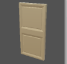

#   JLabGym

This package/project `JLabGym` provides a Java-based environment that will allow you to use the game [Lab Recruits](https://github.com/iv4xr-project/labrecruits) as an 'AI Gym'. An _AI Gym_ is an environment where you can try out your AI, or whatever algorithm X, to perform some tasks in the environment. JLabGym provides a set of methods to control the Lab Recruits game and to obtain its internal state information. The Lab Recruits game itself  allows you to design your own game-level through a simple CSV file, and hence you can design your own specific level layouts, puzzles, hazards, and goals/tasks that your AI can try.


With JLabGym you can programmatically control the player characters in Lab Recruits.


You can instruct a controlled character to report back to you what it observes, to move, or to interact with a certain in-game entity.

### The Lab Recruits Game

The game allows you to load a game-level and play it. It is a single player game, but you can control multiple player-characters. A game level can be setup to contain one or more goal-flags that you have to reach to earn points. However, these are typically placed in rooms with closed doors. To open a door you have to find a matching button and toggle it. Oh, some parts of building might be burning with fire. Avoid fire if you can, as it hurts you.  For more on how to play the game and how to make your own level, see [the game's site](https://github.com/iv4xr-project/labrecruits).

JLabGym allows to to programmatically control player-characters.

### Before Using JLabGym

You first need to get [Lab Recruits](https://github.com/iv4xr-project/labrecruits) from its Git repository and build it. You'll need Unity to build it.

The game requires a game-level to be loaded. `JLabGym` contains some test-levels you can try, here: [`src/test/resources/levels`](./src/test/resources/levels). You can for example try to play (as a human) the `buttons_doors_1.csv` level. The game is not set to have a particular goal (there is no end boss) other than to collect points (and staying alive). However, you can simulate an end goal (or goals) by placing goal flags in your level definition. See the  [site of Lab Recruits](https://github.com/iv4xr-project/labrecruits), it has a wiki explaining the control to play the game as a human, and also a part that explains how to construct your own level with a csv file.

### Using JLabGym

After you build Lab Recruits, now you are ready to use `JLabGym`. Below is a simple example showing how to control Lab Recruits from `JLabGym`. The full example can be found in the class [`Example1`](./src/main/java/examples/Example1.java).

#### 1. Let's start with what you need to import:

```java
// From JLabGym:
import environments.LabRecruitsConfig;
import environments.LabRecruitsEnvironment;
import environments.SocketReaderWriter;
import game.LabRecruitsTestServer;
import game.Platform;
import world.LabWorldModel;
import world.LabEntity;
// From the iv4XR package that JLabGym uses:
import eu.iv4xr.framework.spatial.Vec3;
```
#### 2. Launch Lab Recruits from Java

Locate first the parent directory where your Lab Recruits executable is placed. When you built it, Unity will typically place the produced executable in a structure like this:

```
(some executable root)
   |-- Windows
   |   |-- bin
   |-- Mac
   |-- Linux     
```

You need the path to the "some executable root"; specify this path in the code below. The code will then launch an instance of the Lab Recruits game:

```java
String labRecruitesExeRootDir = ... ;
LabRecruitsTestServer labRecruitsBinding = new LabRecruitsTestServer(
      true, // false if you want to run the game without graphics
      Platform.PathToLabRecruitsExecutable(labRecruitesExeRootDir));
labRecruitsBinding.waitForGameToLoad();
```


#### 3. Load a level and create an instance of [`LabRecruitsEnvironment`](./src/main/java/environments/LabRecruitsEnvironment.java).

This environment will bind itself to the running instance of Lab Recruits (that you just launched above). Once you have this environment, you can use it to control Lab Recruits.

```java
var config = new LabRecruitsConfig(
  "moveToButton", \\ the name of the level to load
  ... , \\ the directory where levels are placed
  );
LabRecruitsEnvironment environment = new LabRecruitsEnvironment(config);
```

#### 4. Now use the env to control the game

**Asking observation.**
For example, we can ask for what the agent (the player character that you control) sees, e.g:

```java
LabWorldModel wom = environment.observe("agent0");
Vec3 p = wom.getFloorPosition() ; // get the agent position
System.out.println("Agent is now at " + p) ;
```

Observation is given as a structured information (so, not as an image!) of type [`LabWorldModel`](./src/main/java/world/LabWorldModel.java), which in turn is a subclass of iv4XR's generic representation of a worl called [`WorldModel`](https://github.com/iv4xr-project/aplib/blob/master/src/main/java/eu/iv4xr/framework/mainConcepts/WorldModel.java).

To ask for an observation, you need to know the Lab Recruits' id of the agent; you can find information in the file that defines the level you load (`moveToButton.csv` in the above example).

We can also ask the state of a game-entity, if it is visible to the agent. You have to know Lab Recruits' id of the entity. You usually can find this in the level definition file.

```java
LabEntity e = wom.getElement("button1") // null if the button is not visible
Vec3 q = e.getFloorPosition() ;
boolean isOn = e.getBooleanProperty("isOn") ;
System.out.println("Position of button1:" + q) ;
System.out.println("The button is turned-on:" + isOn) ;
```

**Moving the agent.** Below we show how you can move the agent towards a certain destination. You can do this by invoking the method `moveToward(p1,p2)` from the environment; `p1` is the agent current position, and `p2` is the destination. This will move the agent in a straight line towards `p2`. Note that the agent is bounded by its movement speed, so it cannot reach `p2` in a single `moveToward` if `p2` is far. Also, `moveToward` assumes that the line segment it tries to move the agent is free from obstacle. For example, the agent cannot move through a wall.

```java
Vec3 destination = new Vec3(1.5f,0,4f) // (x,y,z) position with y on the vertical axis.
LabWorldModel wom = environment.observe("agent0");
environment.moveToward(agent, wom.position, destination);
Thread.sleep(50); // give some delay, then move again:
wom = environment.observe("agent0");
environment.moveToward(agent, wom.position, destination);
```

**Interacting with an entity** In Lab Recruits you can interact with in-game buttons. A button can be in the on-state, or off. Toggling a button might open a door (or more), or close it again. Interacting with a button requires your agent to stand close enough to the button (<= 1.0).

 

Assuming your agent stands close enough to button1, we can do this:

```java
LabWorldModel wom = environment.observe(agent) ;
boolean stateBefore = wom.getElement("button1").getBooleanProperty("isOn") ;
System.out.println("" + stateBefore) // false
wom = environment.interact("agent0", "button1", "");
boolean stateAfter = wom.getElement("button1").getBooleanProperty("isOn") ;
System.out.println("" + stateAfter) // true
```


### Other documentations

* [Controlling and observing Lab Recruits](./docs/ControlAndObservation.md)
* Navigation mesh


### Copyright and License

Copyright (c) 2021, Utrecht University (Department of Information and
Computing Sciences).

License: GNU LGPL.

### Contributors

**Computer Science students from Utrecht University:**
Adam Smits,
August van Casteren,
Bram Smit,
Frank Hoogmoed,
Jacco van Mourik,
Jesse van de Berg,
Maurin Voshol,
Menno Klunder,
Stijn Hinlopen,
Tom Tanis.
**Others:** Wishnu Prasetya, Naraenda Prasetya.
