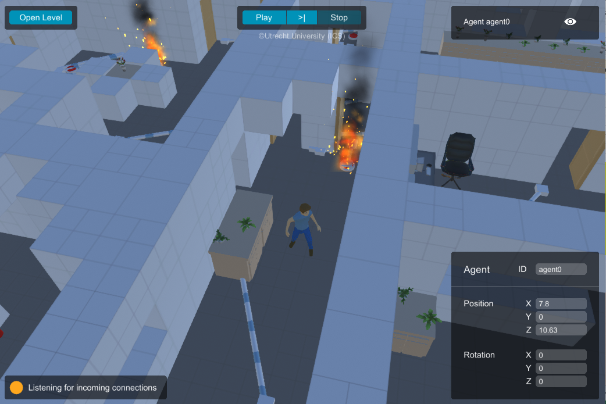
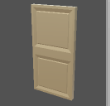
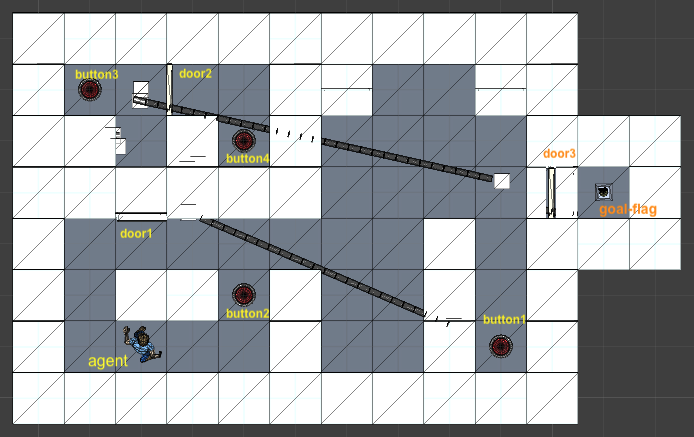

# Game Testing Contest 2021

The goal of this contest is to come up with the best algorithm to automatically test a game called [Lab Recruits](https://github.com/iv4xr-project/labrecruits). To allow your algorithm to control the game, we will be using [JLabGym](https://github.com/iv4xr-project/JLabGym) that will provide you with APIs to interface with Lab Recruits.

##### The Lab Recruits Game

The game allows you to load a game-level and play it. It is a single player game, but you can control multiple player-characters :running: :running: (though in this contest the setup will be single-character). A game level can be setup to contain one or more goal-flags that you have to reach to earn points. However, these are typically placed in rooms with closed doors. To open a door you have to find a matching button and toggle it. Oh, some parts of building might be burning with fire :fire::fire:. Avoid fire if you can, as it hurts you.  

 

##### Level correctness

Although Lab Recruits allows you to define a game-level through a CSV file, for this competition we will pretend that your test algorithm has no knowledge of this CSV file. After all, in practice real game levels are typically hand crafted rather than generated from a CSV file. An important part of the correctness of a Lab Recruits game-level is the connection between the buttons and doors. If some buttons turn out to open the wrong doors, the level might become too easy to solve, or worse, it might become unplayable.

   

The figure below shows the floor-plan of a game-level in Lab Recruits. It has four buttons and three doors; their IDs are given in the yellow/orange texts. The level's goal is for the player to reach the goal-flag in the small room to the east. All doors are initially closed.



In the level above the connections are as follows:

 1. `button1` toggles `door1`
 1. `button3` toggles `door1`, `door2`, and `door3`
 1. `button4` toggles `door1`

Notice that to get to the goal-flag the player first needs to open `door3`, which in turns requires the player to first get to `button3` and toggles it. If the 3rd connection above is broken, opening `door3` would also leave the player to become trapped in the room where `button3` is.  

---
### The task of your test algorithm
---

Write a test algorithm that can explore a loaded game-level to discover all the buttons and doors connections of this level. The algorithm reports its finding as a **set of pairs** _(b,d)_ to say that the button with id _b_ is connected to a door with id _d_. Note that as in the example above, the same button can be connected to multiple doors, and conversely the same door can be connected to multiple buttons. Pairs not in the reported set are interpreted as having no connection.

So, for the level shown above, a sound and complete agent would report the following set:

  > _{ (button1,door1), (button3,door1), (button3,door2), (button3,door3) (button4,door1) }_

After reporting the findings, your algorithm indeed still does not know if the level is correct or incorrect. The task of evaluating the findings is beyond the scope your algorithm. You can imagine that either the level designers manually inspect your findings, or some other program does that. Either way, your algorithm already shoulders much automation for the overall task of verifying the level's correctness.

It is important that your algorithm is sound and complete. It is _complete_ if it does not miss any connection. It is _sound_ if it does not report a connection that is actually not there.

---
### Implementation
---

You need two things before you start implementing your test algorithm for this contest:

1. You need the game [Lab Recruits](https://github.com/iv4xr-project/labrecruits). Get it from Github; its Github site has instructions on how to build the game.
1. You would also need [iv4XR Framework](https://github.com/iv4xr-project/aplib).

Next, you need [JLabGym](https://github.com/iv4xr-project/JLabGym). **Make a copy** of this project, then implement your test algorithm/AI in the class [`gameTestingContest.MyTestingAI`](../../src/main/java/gameTestingContest/MyTestingAI.java). More specifically, the method `exploreLRLogic`:

```java
public class MyTestingAI {
  public Set<Pair<String, String>> exploreLRLogic(LabRecruitsEnvironment environment) throws Exception {
       ... // implement your test-algorithm here
   }
}
```

The method is expected to explore the currently loaded Lab Recruits level to report back the connections between the buttons and doors in that level. The method should return this finding as a set of pairs _(b,d)_ of button-id and door-id that your algorithm thinks to be connected. As you can see above, the method receives an `environment`; this will provides the APIs that will let you programatically control Lab Recruits.
**Note:** you algorithm should not try to exploit the information in the level definition files; this will defeat the purpose of the Contest.

You are free to extend the project, but do not change the signature of any of the classes in the package `gameTestingContest`, and few other classes listed under 'Integrity Requirement' below. Also, keep it as a Java and Maven project. Make sure that we (the Contest organizer) can easily and smoothly maven-build your JLabGym project.

**Testing your algorithm**: you can run it from the main method of the class [`gameTestingContest.RawContestRunner`](../../src/main/java/gameTestingContest/RawContestRunner.java). You need to configure several things first, like the location of the Lab Recruits executable and the name of the level to load. See the documentation in the source code of `RawContestRunner`.

**Levels to try**: you can find a set of levels you can use to test your algorithm, in `src/test/resources/levels/contest`. Do keep in mind that your solution should be generic enough to handle an arbitrary Lab Recruits level. Some scoping conditions will be mentioned in the "Scoring" section below.

**Contest Integrity Requirement**: to assure fair scoring, you should refrain from modifying the following classes:
  * the class `gameTestingContes/ContestRunner.java`.
  * all classes in under `/environments`.
  * the class `helperclasses/CSVExport.java` and `helperclasses/Util.java`.

If these files are changed, the benchmarking will not use them.  


#### APIs and other information
  * [APIs: controlling and observing Lab Recruits](../ControlAndObservation.md)
  * [Navigating in the game-world](../navigation.md)
  * [More information about JLabGym](https://github.com/iv4xr-project/JLabGym)
  * [More on the sample levels](./samples.md)

---
### Submission
---

Upload a zip containing you JLabGym (maven) project; a url will be provided for this. Don't include binaries in the zip. The project should be a **maven project**; make sure that we will be able to build your
project at our site.

During the evaluation we will benchmark your MyTestingAI against a series of game-level. The scoring will be based on the soundness and completeness of your algorithm, and its time performance.

---
### Scoring
---

Your submission will be benchmarked against one or more sets of levels. The benchmark sets are deliberately kept secret from you, but you can assume the following:

* The levels will have only a single character/agent to control.
* All levels only have a single floor (so, no multi-floor setup).
* The difficulty level (see below) is at most 3.

Your score is calculated as follows.

* Your score on a given game-level is pair calculated as follows (**lower is better**):

  > **score**(level) = (v,T), where v = (5 - diff)∗(FP + NP)

  * _FP_: number of _false positives_. A false positive occurs when you report a link (b,d) to say that the button b can toggle the door d, but this link  does **not** actually exist.
  * _NP_: number of _false negative_. A false negative occurs when there is an actual link (b,d), but your algorithm fails to report this.
  * _T_: the run time of your algorithm until it returns (and thus delivering its findings/report). This is capped at Tmax = _B∗D∗10_ seconds, where _B_ is the total number of buttons in the level, and _D_ the total number of doors. This cap is enforced through interrupt. That is, our runner will interrupt the thread that runs your algorithm at time Tmax. After that your algorithm has 10s time to close gracefully, after which we will force the thread to stop. 
  * diff: the difficulty of the level (higher is more difficult):
    > diff = **max**(α,β) + o

    α is the maximum number of doors connected to the same button; β is the maximum number of buttons connected to the same door; o is 1 if some doors are initially open, else it is 0.

* A benchmark os a set S of level. Your score on a given benchmark S is the sum of the scores of each level in S:

  > **score**(S) = (V,T') where
  > V = ∑{ v | lev in S, score(lev) = (v,T)}
  > T' = ∑{ T | lev in S, score(lev) = (v,T)}

* The scores of the contestants are then ranked lexicographically, in reverse order (so, smaller values are better). The submission with the smallest score wins.
