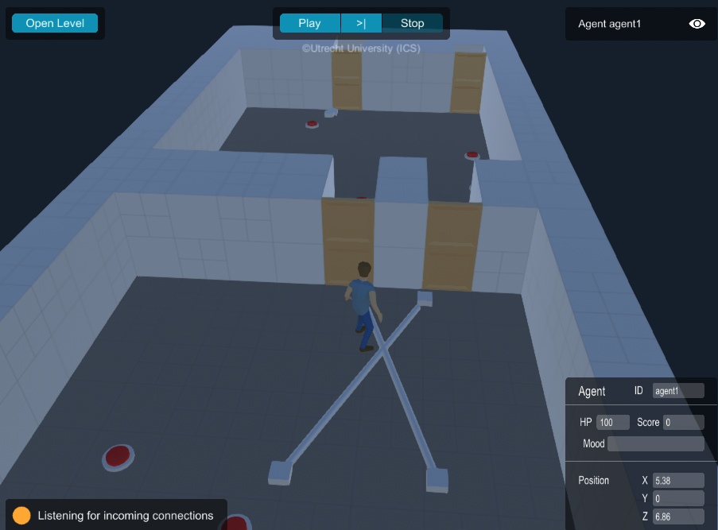
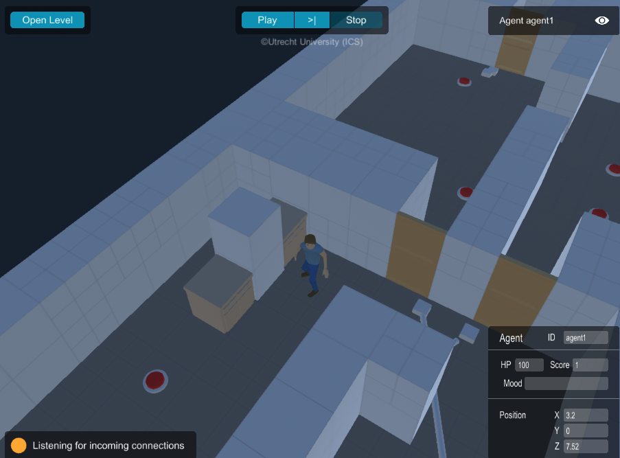
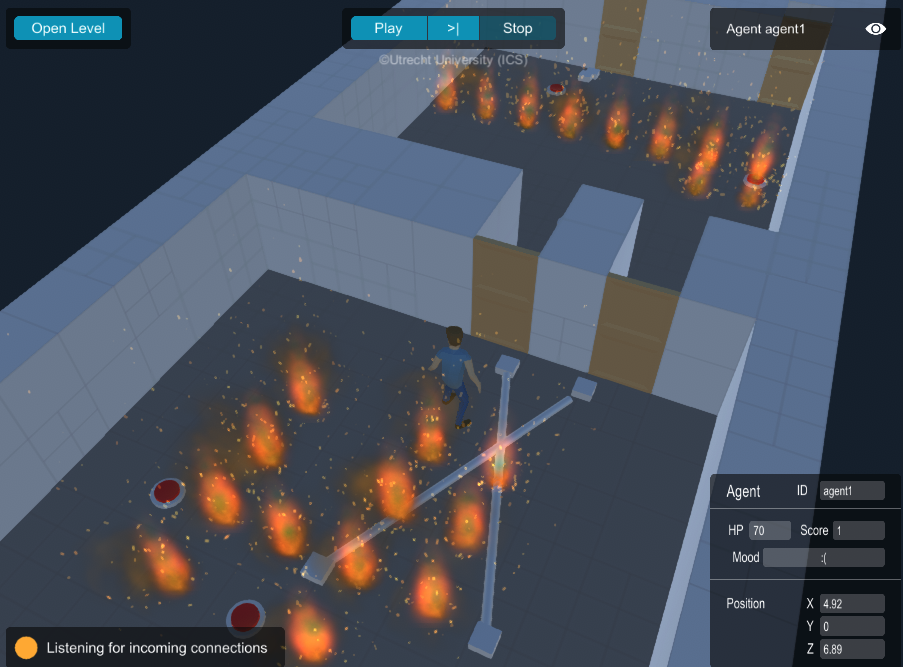
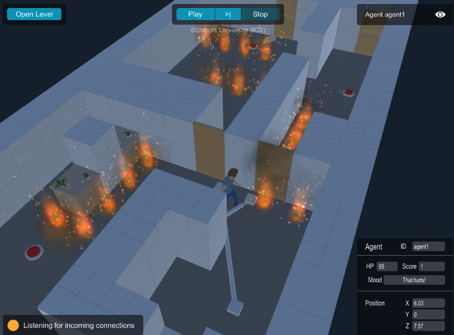
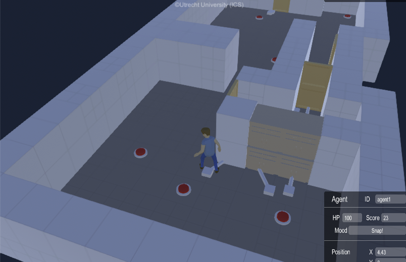
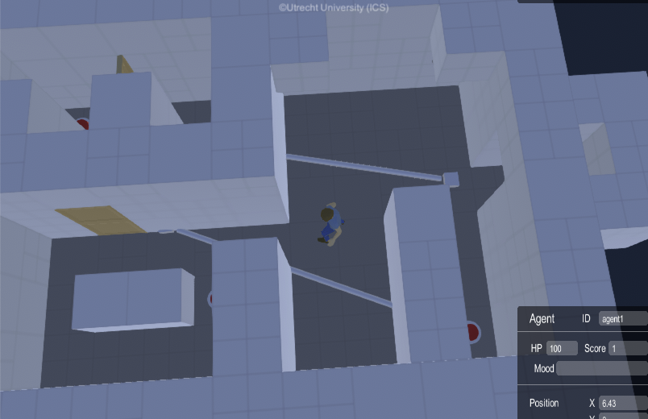
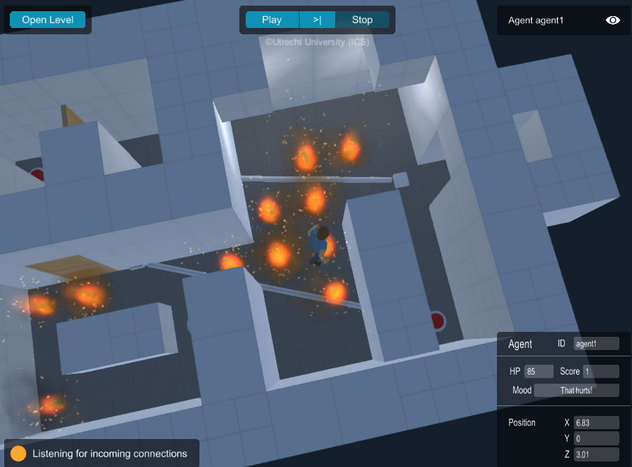
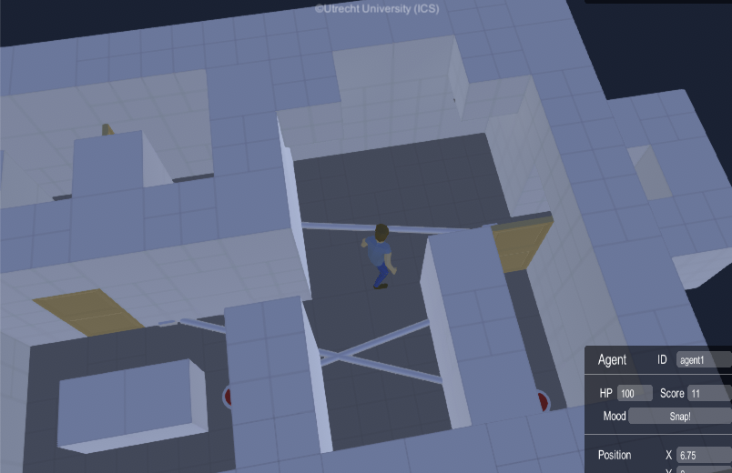

# Some sample game-levels

You can find a set of levels you can use to test your algorithm, in `src/test/resources/levels/contest`. Below is an overview of their properties.

| Level Name | #room | #doors | #buttons | #links | α | β | doors initial state | maze | hazard |
|--|--|--|--|--|--|--|--|--|--|
| [CR3_1_1.csv](../../src/test/resources/levels/contest/CR3_1_1.csv)   | 3 | 8 | 4 | 3 | 1 | 1 | closed | N | N |
| [CR3_1_1_M.csv](../../src/test/resources/levels/contest/CR3_1_1_M.csv)  | 3 | 8 | 4 | 3 | 1 | 1 | closed | Y | N |
| [CR3_1_1_H.csv](../../src/test/resources/levels/contest/CR3_1_1_H.csv)  | 3 | 8 | 4 | 3 | 1 | 1 | closed | N | Y |
| [CR3_1_1_MH.csv](../../src/test/resources/levels/contest/CR3_1_1_MH.csv)  | 3 | 8 | 4 | 3 | 1 | 1 | closed | Y | Y |
| [OR3_2_1.csv](../../src/test/resources/levels/contest/OR3_2_1.csv)  | 3 | 8 | 4 | 4 | 2 | 1 | some are open | N | N |
| [CR3_3_3_M.csv](../../src/test/resources/levels/contest/CR3_3_3_M.csv)  | 3 | 3 | 4 | 5 | 3 | 3 | closed | Y | N |
| [CR3_3_3_MH.csv](../../src/test/resources/levels/contest/CR3_3_3_MH.csv)  | 3 | 3 | 4 | 5 | 3 | 3 | closed | Y | Y |
| [OR4_3_3_M.csv](../../src/test/resources/levels/contest/OR4_3_3_M.csv)  | 4 | 4 | 4 | 6 | 3 | 3 | some is open | Y | N |

α : the maximum number of doors that a single button can toggle.
β : the maximum number of buttons that can toggle the same door.
 #links : the number of "links". When a button b can toggle a door d, that counts for one link.
