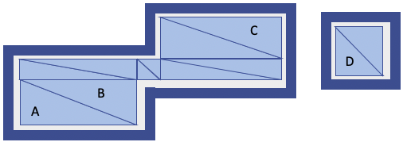

# Navigation in the Lab Recruits' World

Programmatically guiding your agent :running: to go from one location to another can be pretty challenging. If there is a wall or a cabinet in front of the agent, you will have to guide the agent to somehow get around the obstacle. There might also be a closed door that stands in the way; so you may have to find a way to open the door first.

JLabGym provides something called _navigation mesh_ that you can use for guiding your agent's navigation. This will at least enable your agent to get around static obstacles such as walls (but not dynamic obstacles such as doors).

---
### Navigation Mesh
---

Recall that the class [`LabRecruitsEnvironment`](../src/main/java/environments/LabRecruitsEnvironment.java) provides you with the APIs to control and observe the Lab Recruits game. Here is again a snippet to launch Lab Recruits, load a game-level, and create an instance of `LabRecruitsEnvironment` that would bind to that running instance of Lab Recruits:

```java
String labRecruitesExeRootDir = ... ;
var labRecruitsBinding = new LabRecruitsTestServer(
    true,
    Platform.PathToLabRecruitsExecutable(labRecruitesExeRootDir));
labRecruitsBinding.waitForGameToLoad();
var config = new LabRecruitsConfig("moveToButton", \\ the name of the level to load
    ... , \\ the directory where levels are placed
    );
var environment = new LabRecruitsEnvironment(config);
```

As you create an instance of `LabRecruitsEnvironment` like this, it will also ask to the running Lab Recruits to send back so-called _navigation mesh_ of the game-level that you load onto it. In the above snippet, we load a level called _moveToButton_ (you can fine the level definition in [`src/test/java/resources/levels/moveToButton.csv`](../src/test/java/resources/levels/moveToButton.csv)). So the game will send back the navigation mesh of this level.

A navigation mesh is a data structure that describes the areas of the game that is walkable :walking: by a player character (agent). For example, an agent can walk on the floor surface of the loaded game-level, but not through walls. So, the navigation mesh would cover, in principle, the floor surface, and exclude the walls.

The mesh is described in terms of a set of connected triangles. Each triangle represent an area that is walkable. The figure below shows an example:




_Figure 1_: we an example of a game-level consisting of three rooms, and how its floor is rendered to a navigation mesh.


Note that just because an area is walkable does not mean that it is also reachable for the agent. E.g. the area D in the above example is walkable, but not reachable from A.

Now, when two triangles in the navigation mesh are _connected_ (they have a common edge), such as triangles A and B in the above example, it means: (a) the areas of both are walkable, and (b) they are reachable from one another; that is, it is possible for the agent to walk from one area to another without bumping into a wall or other (static) obstacles. By traveling from one triangle to a neighboring triangle, you can now in principle plan a path that would guide your agen, for example, to travel from triangle A to triangle C in the above example.

This navigation mesh is available in the field `worldNavigableMesh` of your instance of `LabRecruitsEnvironment`. So, if `env` is your instance of `LabRecruitsEnvironment`, then `env.worldNavigableMesh` contains this navigation mesh. The information from the mesh can be inquired as follows. Let `mesh` be the value of `env.worldNavigableMesh`. This value is of type [`Mesh`](https://github.com/iv4xr-project/aplib/blob/master/src/main/java/eu/iv4xr/framework/spatial/meshes/Mesh.java).

1. `ArrayList<Vec3> mesh.vertices` contains the 3D coordinates/locations of all the corners of the triangles in the mesh. Rather than calling them 'corners' we will call them _nodes_.

1. `ArrayList<Edge> mesh.edges` is the set of all edges/lines between the nodes. If `e` is an [`Edge`](https://github.com/iv4xr-project/aplib/blob/master/src/main/java/eu/iv4xr/framework/spatial/meshes/Edge.java), it connects the nodes `e.i` and `e.j`.

  However `e.i` and `e.j` are not 3D coordinates. Rather, they are indices of `mesh.vertices`. So, if you want to know which 3D locations are connected by `e`, they are `mesh.vertices.get(e.i)` and `mesh.vertices.get(e.j)`.

  Lines between two nodes are guaranteed to be walkable and free of (static) obstacles such as walls. Do keep in mind that a dynamic obstacle such as a door (that can open or close at the runtime) can still block the line.

1. `ArrayList<Face> faces` is the set of triangles in the mesh. Each [`Face`](https://github.com/iv4xr-project/aplib/blob/master/src/main/java/eu/iv4xr/framework/spatial/meshes/Face.java) `f` in this set represents a triangle; it has a field `f.vertices` that contains the corners of the triangles. `f.vertices` is however not literally a set of 3D locations. Instead it is an array of integers, each is an index in  `mesh.vertices`, from where you can obtain its 3D location.

Note that `mesh.edges` is actually sufficient for you to guide the agent to go from one node to another.

---
### Relation with observation
---

When your agent report an observation, e.g. because you call `env.observe(agentId)`, the observation is given as an instance of `LabWorldModel`. Let's call this instance `o`. This observation also contains information of which nodes in the navigation mesh that are visible to the agent. This is availble in the field:

   `int[] o.visibleNavigationNodes`

Note that elements of this array are not 3D locations, but rather, indices in `mesh.veritices`.

By default, the agent's visibility range is set to 10 distance units. Regardless the range, an agent cannot see through a solid wall.   
